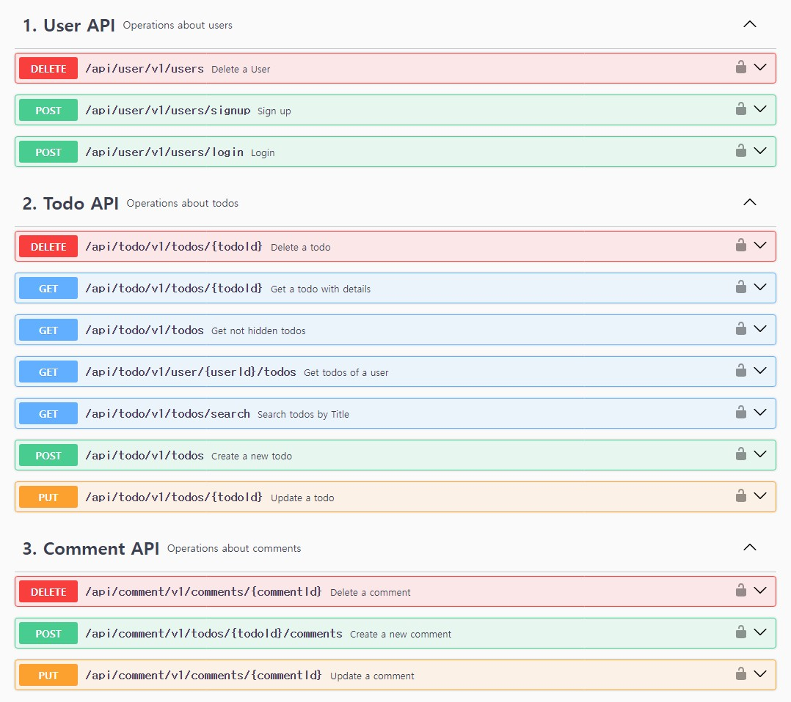
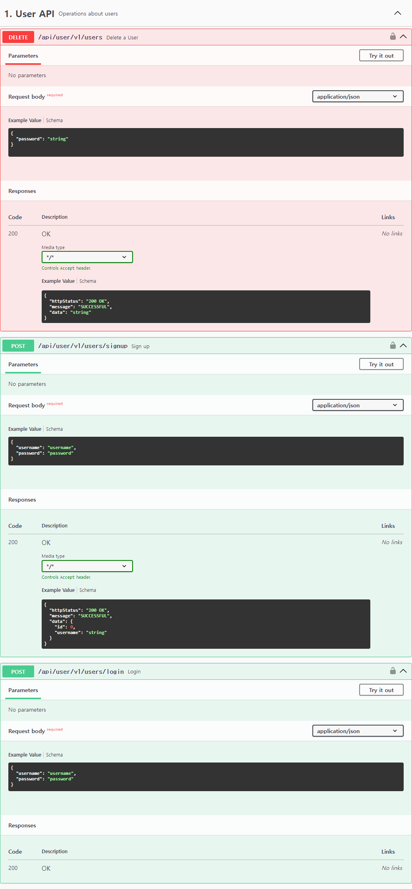
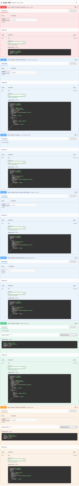
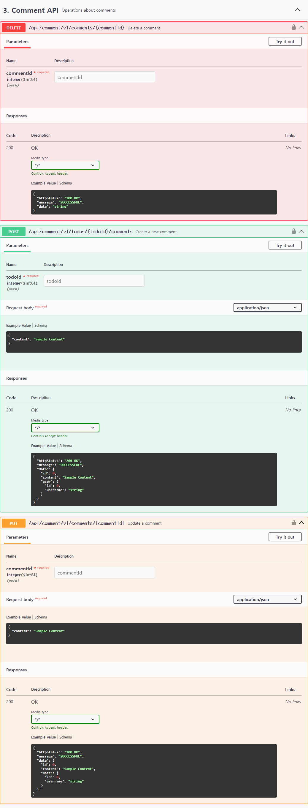

<!-- PROJECT LOGO -->
 

<h1 align="center">Todo</h1>

  

    "회원가입, 로그인 기능이 있는 투두앱 백엔드 서버 만들기" 
     
    <a href="https://github.com/Ruh0n/nbcamp-spring-todo"><strong>Explore the docs »</strong></a>
     
  

<!-- ERD -->

## ERD

(<a href="#readme-top">back to top</a>)

 

<!-- API 명세서 -->

## API 명세서

### User API

(<a href="#readme-top">back to top</a>)

 

(<a href="#readme-top">back to top</a>)

 

### Todo API

(<a href="#readme-top">back to top</a>)

 

### Comment API

(<a href="#readme-top">back to top</a>)

 

<!-- Built With -->

### Built With

* [![Java][Java-shield]][Java-url]
* [![SpringBoot][SpringBoot-shield]][SpringBoot-url]
* [![MySql][MySql-shield]][MySql-url]

(<a href="#readme-top">back to top</a>)

<!-- MARKDOWN LINKS & IMAGES -->
<!-- https://www.markdownguide.org/basic-syntax/#reference-style-links -->

[Java-shield]: https://img.shields.io/badge/Java-ED8B00?style=for-the-badge&logo=openjdk&logoColor=white

[Java-url]: https://adoptium.net/

[SpringBoot-shield]: https://img.shields.io/badge/SpringBoot-6DB33F?style=flat-square&logo=Spring&logoColor=white

[SpringBoot-url]: https://spring.io/

[MySql-shield]: https://shields.io/badge/MySQL-lightgrey?logo=mysql&style=plastic&logoColor=white&labelColor=blue

[MySql-url]: https://www.mysql.com/
